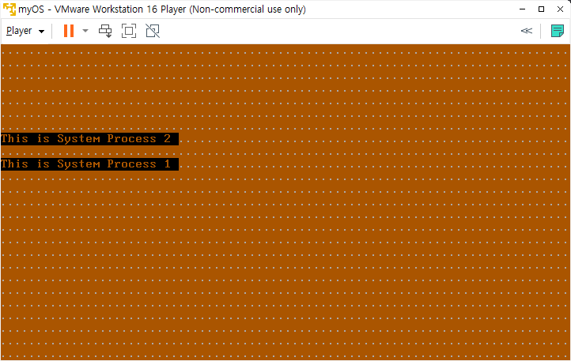

# os-making

currently applying kernel protection

- making history
  - 2021-06-14: task switching
  - 2021-06-13: interrupt/exception enabled
  - 2021-06-03: PIC setting completed
  - 2021-05-13: IDT added
  - 2021-05-08: entered protected mode
  - 2021-04-25: bootstrap
  - 2021-04-24: environment setting

## environment

- assembly tool: nasm
- os emulator: vmware workstation player
- hex editor: hxd

## references

- lk little kernel
- books
  - 김범준. 2005. 만들면서 배우는 OS 커널의 구조와 원리, 한빛미디어
- sites
  - rust로 os 만들기: https://os.phil-opp.com/
  - Intel® 64 and IA-32 Architectures Software Developer’s Manual: https://software.intel.com/content/www/us/en/develop/download/intel-64-and-ia-32-architectures-sdm-combined-volumes-1-2a-2b-2c-2d-3a-3b-3c-3d-and-4.html
  - nasm tutorial: http://www.tutorialspoint.com/assembly_programming/index.htm
  - 만들면서 배우는 OS 커널의 구조와 원리 공부하면서 정리한 블로그: https://itguava.tistory.com/8
